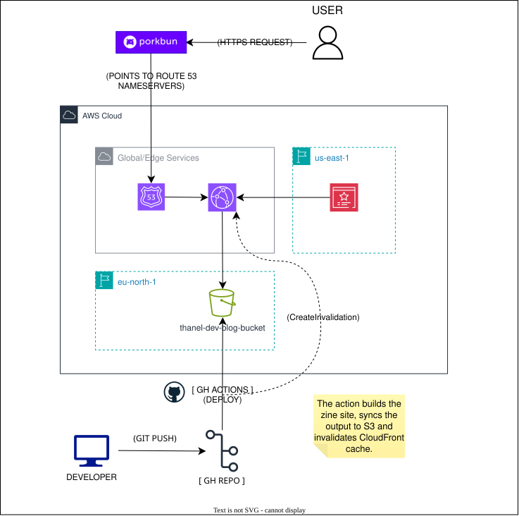

# thanel.dev

[](https://www.terraform.io/)
[](https://aws.amazon.com/)
[](https://zine-ssg.io/)

This repository contains the infrastructure configuration and code used to generate my personal website [thanel.dev](https://thanel.dev).

The `infrastructure/` directory contains the complete AWS setup provisioned via Terraform, designed specifically for full reproducibility.

If you are interested in provisioning the same AWS infrastructure in seconds, check out the [Deployment Guide](#deployment-guide) down below.

---

## Architecture

<p align="center">
  
</p>

### Infrastructure Stack

**Hosting**  
AWS S3 private bucket, restricted to access only through CloudFront Origin Access Control.

**CDN**  
AWS CloudFront global distribution providing HTTPS redirection and edge caching.

**DNS**  
AWS Route 53 hosted zone managing domain records. The apex domain is registered via Porkbun.

**TLS Certificate**  
AWS Certificate Manager handling DNS-validated, auto-renewing SSL certificates.

**Authentication**  
OpenID Connect (OIDC) protocol establishing passwordless key trust between GitHub Actions and AWS.

**Infrastructure as Code**  
Terraform managing cloud resources with state stored in a remote S3 backend.

### CI/CD Pipeline

Pushing commits to the `main` branch triggers an automated GitHub Actions workflow. The pipeline executes Zine to compile the static website, synchronizes the generated files to the private S3 bucket, and invalidates the CloudFront cache to immediately serve updated content.

---

## Deployment Guide

1. Create the backend configuration file from the example template.
```bash
cp infrastructure/backend.hcl.example infrastructure/backend.hcl
```

2. Create the Terraform variables file from the example template.
```bash
cp infrastructure/terraform.tfvars.example infrastructure/terraform.tfvars
```

3. Provision the infrastructure on AWS.
```bash
cd infrastructure
terraform init -backend-config=backend.hcl
terraform plan
terraform apply
```

---

## AWS Costs?

Effective running costs range between **$0.00 and $1.00 per month**.

AWS Free Tier covers S3 storage and CloudFront data transfer for personal blog traffic levels. Fixed charges consist of the Route 53 hosted zone at approximately $0.50 per month and the annual Porkbun domain registration fee.
